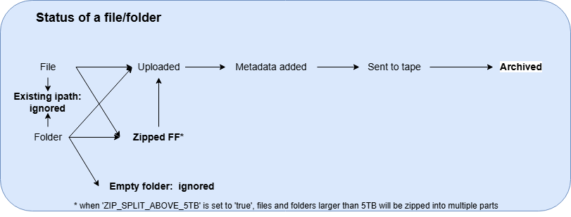

# iRODS ingest
In the last few years there has been a lot of development around iRODS at the WUR. As main author, I was personally involved in quite a few of these innovations. Each one taught me new lessons, which I combined in this script to help others get started with uploading data to the tape archive. 

This respository contains an configurable script to move data to iRODS/tape, and add the metadata provided in an Excel file. It was build to work with the WUR iRODS instances, but its modulair design make it easy to convert to other iRODS setups.
Where Ubuntu and IOS are supported this has not been tested and might contain some bugs. 

How it works in a nutshell:
- 1.Load excel and check if the Foldernames with a `v` in the_to_upload
column exists in the folder 
- 2. Generate `in_progress.csv` this file is used to store the irods, zip paths and the current status of the processing
- 3. Use multiprocessing to zip folders if desired
- 4. Upload the files/folder to iRODS
- 5. Add the metadata to the file/folder
- 6. If desired send the file to tape
- 7. Check if the file is on tape

Statusses in the `_status` columns and the transfer from one to another is vizualized in the image below
<p align="center">

</p>


At each status change the `in_progress.csv` file is updated to enable the script to continue where it stopped. Next to this it uses multiprocessing to make optimal use of the available resources, including a way to limit the disk space usage. Before the upload various checks are performed to ensure iRODS and SQL naming conventions are met, on top of this it is advised to check the metadata for consistency (not implemented).


## Important notes:
- Issue with irods path prevents the entering of `/zone/home/xx`, it does allow `/zone/home/username`. Therefor it's currently diabled and set fixed to `/zone/home`
- It is advised to only upload files, or zipped folders, to tape

NPEC specific details one has to change before adopting the script:
- Metadata is set with a 'NPEC_' prefix,in i_operations.py > add_metadata > `tagname = f"NPEC_{col}"`
- iRODS paths are created using the npec structure: `ipath = target_ipath.joinpath('M4', row['System'].upper(), str(row['Year']))` in helpers.py >> create_task_df.


## Preperation
The key in this whole process in the Excel file accopanying the data in the folder.
It has two manditory columns:
- `Foldername`: name of the file/folder to upload, this must be placed in the same folder as the excel file!
- `_to_upload`: Add a `v` in this column to indicate the row should be uploaded, all rows without a `v` are ignored.
Additional columns can be added, these will become metadata fields. They may not start with a `_`!
As example NPEC uses the folowing columns: 
```
- Foldername: name of the file/folder
- Year: 2024
- NPEC module: ClimateCells, Greenhouse, OpenField
- System: G8, Traitseeker, UAVS
- Client: requester of the experiment
- Crop: plants (comma seperated list)
- Comment: free text
- _to_upload: Add a `v`
```

An example Excel is provided in the test_data folder:
<p align="center">

</p>


## Config
A config file is used to pass all the parameters, the goal is to make it easy to repurpose the code:
```
{
    "SMB_MOUNT": true, # Used to automatically mount an SMB mountable disk like the W (isilon) at WUR
    "ZIP_FOLDERS": true, # Zip the folders before uploading, this is advised when sending data to the tape archive
    "TO_TAPE": true, # Wether or not to trigger the archive rule to move the data fromdisk to tape after uploading
    "NUM_ZIPPERS": 1, # Num of zip processes
    "NUM_IWORKERS": 1, # Numer of irods uploaded processes
    "SMB": {
        "SMB_USER": "<user>", # SMB username
        "SMB_PATH":"\\\\fs02mixedsmb.wurnet.nl\\TPE-STANDARD_PROJECTS$\\PROJECTS~NPEC_climaterooms\\", # Example path
        "SMB_LETTER": "W" # Device letter to mount the disk to
    },
    "IRODS_ENV_FILE": "irods_environment.json",
    "LOCAL_SOURCE_PATH": "C:\\iRODS_ingest\\test_data", # Folder containing the data to upload
    "LOCAL_ZIP_TEMP": "Z:\\test_zips", # Path to create the temporary zipfiles when uploading folders
    "LOCAL_ZIP_SPACE": "30GB", # Size of the temporary zip area in human readable size, to avoid overflowing disks
    "IRODS_TARGET_PATH": "", # ignored due to bug, see notes
    "METADATA_EXCEL": "test_metadata.xlsx" # Excel file with the list of files to upload and metadata
}
```

### Zipping
The default zip implementations in python work, but they are awfully slow. As is windows itself. In the search for alternatives this comparison came up: https://peazip.github.io/peazip-compression-benchmark.html
As winrar was one of the fastest and also has an API this was preferred and implemented. Note, the special file formats like 7z might be faster, but they also require every user to install that tool while zips are universal. 

A simple benchmark comparison on a folder of 1.18 TB containing: 103,488 Files, 8,099 Folders.
- Winrar zipfile of 666 GB created in: 6:47:00 
- Shutil make archive created a zip file of 666 GB in 1 dyg and 9:17:00

When a users installs winrar the zip implementation will detect it and use it instead of shutil. 